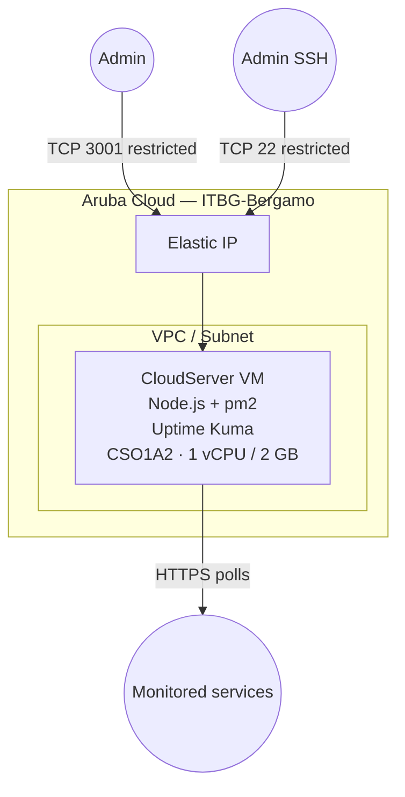

# Uptime Kuma on Aruba Cloud

Deploy [Uptime Kuma](https://github.com/louislam/uptime-kuma) — a self-hosted monitoring tool and status page — on a minimal Aruba Cloud VM.

> **Provider version:** arubacloud/arubacloud `~> 0.5` | **Terraform:** ≥ 1.9

---

## Introduction

Uptime Kuma monitors websites, APIs, TCP ports, DNS records, and more. It provides real-time notifications via Telegram, Slack, Discord, email, and many other channels. A public status page can be shared with your users.

Deploy it on Aruba Cloud to monitor all your other Aruba Cloud examples from the same region.

---

## Architecture Overview



---

## Infrastructure Created

| Resource | Description |
|----------|-------------|
| `arubacloud_project` | `kuma-prod` |
| `arubacloud_cloudserver` | `kuma-prod-vm` (CSO1A2) |
| `arubacloud_blockstorage` | 20 GB boot disk |
| `arubacloud_elasticip` | Public IP |
| `arubacloud_securitygroup` | TCP 3001 + SSH 22 ingress |

---

## VM Sizing

A `CSO1A2` (1 vCPU / 2 GB) VM is sufficient for hundreds of monitors. Scale up only if you run many concurrent checks with sub-second intervals.

---

## Estimated Monthly Cost

| Resource | Est. cost/mo |
|----------|-------------|
| CSO1A2 VM | ~€10 |
| 20 GB disk | ~€3 |
| Elastic IP | ~€5 |
| **Total** | **~€18/mo** |

---

## Variables

### Required
`arubacloud_client_id`, `arubacloud_client_secret`, `ssh_public_key`

### Optional

| Variable | Default | Description |
|----------|---------|-------------|
| `kuma_port` | `3001` | Web UI port |
| `admin_cidr` | `"0.0.0.0/0"` | CIDR for web UI access — **restrict to your IP** |
| `ssh_cidr` | `"0.0.0.0/0"` | CIDR for SSH — **restrict to your IP** |
| `vm_flavor` | `"CSO1A2"` | Smallest available VM |
| `vm_disk_size_gb` | `20` | Disk in GB |

---

## Deployment

```bash
cd terraform-arubacloud-examples/uptime-kuma
cp terraform.tfvars.example terraform.tfvars
terraform init && terraform apply
```

After ~5 minutes:

```bash
terraform output app_url
# http://203.0.113.10:3001
```

Open the URL and create your admin account on first visit.

---

## Destroy

```bash
terraform destroy
```

---

## Security Recommendations

1. **Restrict `admin_cidr` to your IP** — the web UI has no rate limiting on login attempts.
2. **Add HTTPS** — put Uptime Kuma behind the Traefik example for TLS termination, or use Caddy as a reverse proxy on the same VM.
3. **Enable 2FA** in Uptime Kuma Settings → Two Factor Authentication.

---

## Troubleshooting

### UI not loading

```bash
ssh ubuntu@$(terraform output -raw public_ip)
sudo -u kuma pm2 status
sudo -u kuma pm2 logs uptime-kuma --lines 50
```

### Service not starting after reboot

```bash
sudo systemctl status pm2-kuma
sudo systemctl start pm2-kuma
```

---

## References

- [Uptime Kuma GitHub](https://github.com/louislam/uptime-kuma)
- [Uptime Kuma Wiki](https://github.com/louislam/uptime-kuma/wiki)
