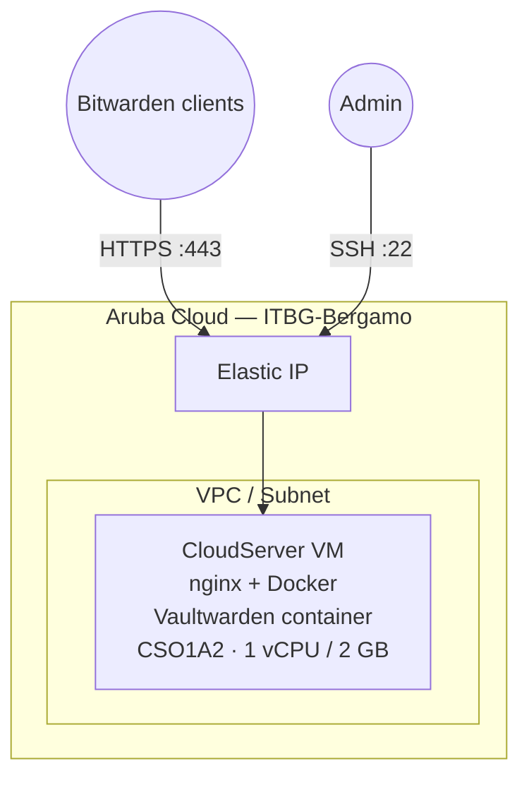

# Vaultwarden on Aruba Cloud

Deploy [Vaultwarden](https://github.com/dani-garcia/vaultwarden) — an unofficial Bitwarden-compatible server — for self-hosted password management on Aruba Cloud.

> **Provider version:** arubacloud/arubacloud `~> 0.5` | **Terraform:** ≥ 1.9

---

## Introduction

Vaultwarden is a lightweight Rust implementation of the Bitwarden server API, compatible with all official Bitwarden clients (desktop, mobile, browser extension). Your passwords are stored entirely on your Aruba Cloud VM — not on third-party infrastructure.

> **HTTPS is required** for mobile Bitwarden clients. Set the `domain` variable and point your DNS before deploying.

---

## Architecture Overview



---

## Infrastructure Created

| Resource | Description |
|----------|-------------|
| `arubacloud_cloudserver` | `vw-prod-vm` — nginx + Vaultwarden in Docker |
| `arubacloud_blockstorage` | 20 GB boot disk |
| `arubacloud_elasticip` | Public IP |
| `arubacloud_securitygroup` | TCP 80/443/22 ingress |

---

## VM Sizing

`CSO1A2` (1 vCPU / 2 GB) comfortably handles a family or small team. Vaultwarden is extremely lightweight.

---

## Estimated Monthly Cost

| Resource | Est. cost/mo |
|----------|-------------|
| CSO1A2 VM | ~€10 |
| 20 GB disk | ~€3 |
| Elastic IP | ~€5 |
| **Total** | **~€18/mo** |

---

## Variables

### Required

`arubacloud_client_id`, `arubacloud_client_secret`, `ssh_public_key`

### Optional

| Variable | Default | Description |
|----------|---------|-------------|
| `domain` | `""` | Domain for HTTPS — **required for mobile clients** |
| `admin_email` | `""` | Email for Let's Encrypt (required when `domain` set) |
| `admin_token` | `""` | Token for `/admin` panel; leave empty to disable |
| `vaultwarden_version` | `"latest"` | Docker image tag |
| `ssh_cidr` | `"0.0.0.0/0"` | SSH source CIDR — restrict to your IP |
| `vm_flavor` | `"CSO1A2"` | VM size |

---

## Deployment

```bash
cd terraform-arubacloud-examples/vaultwarden
cp terraform.tfvars.example terraform.tfvars
# Set domain, admin_email, admin_token in terraform.tfvars
# Create DNS A record: domain → (will be the Elastic IP)
terraform init && terraform apply
```

Open `terraform output app_url` in your browser and create your account.

---

## Destroy

```bash
terraform destroy
```

---

## Security Recommendations

1. **Always use HTTPS** — set `domain` and configure DNS before deploy. Mobile clients refuse HTTP.
2. **Disable the admin panel** if you don't need it (leave `admin_token` empty). The admin panel provides full server access.
3. **Back up `/opt/vaultwarden/data`** regularly — it contains your encrypted vault database.
4. **Pin the image version** — set `vaultwarden_version = "1.32.0"` instead of `latest` in production.

---

## Backup and Restore

```bash
# Backup (run on server)
sudo tar -czf /tmp/vaultwarden-backup-$(date +%Y%m%d).tar.gz /opt/vaultwarden/data
scp ubuntu@<IP>:/tmp/vaultwarden-backup-*.tar.gz ./

# Restore
scp ./vaultwarden-backup-*.tar.gz ubuntu@<IP>:/tmp/
ssh ubuntu@<IP> 'docker stop vaultwarden && sudo tar -xzf /tmp/vaultwarden-backup-*.tar.gz -C / && docker start vaultwarden'
```

---

## Troubleshooting

### Mobile client says "Invalid SSL certificate"

The domain must resolve to the server IP **before** `terraform apply`. Check DNS propagation and re-run apply (Certbot will retry).

### Cannot log in from mobile after HTTP-only deployment

Mobile clients require HTTPS. Set the `domain` variable and re-apply.

### Container not running

```bash
ssh ubuntu@$(terraform output -raw public_ip)
docker ps -a
docker logs vaultwarden
```

---

## References

- [Vaultwarden Wiki](https://github.com/dani-garcia/vaultwarden/wiki)
- [Bitwarden Clients](https://bitwarden.com/download/)
