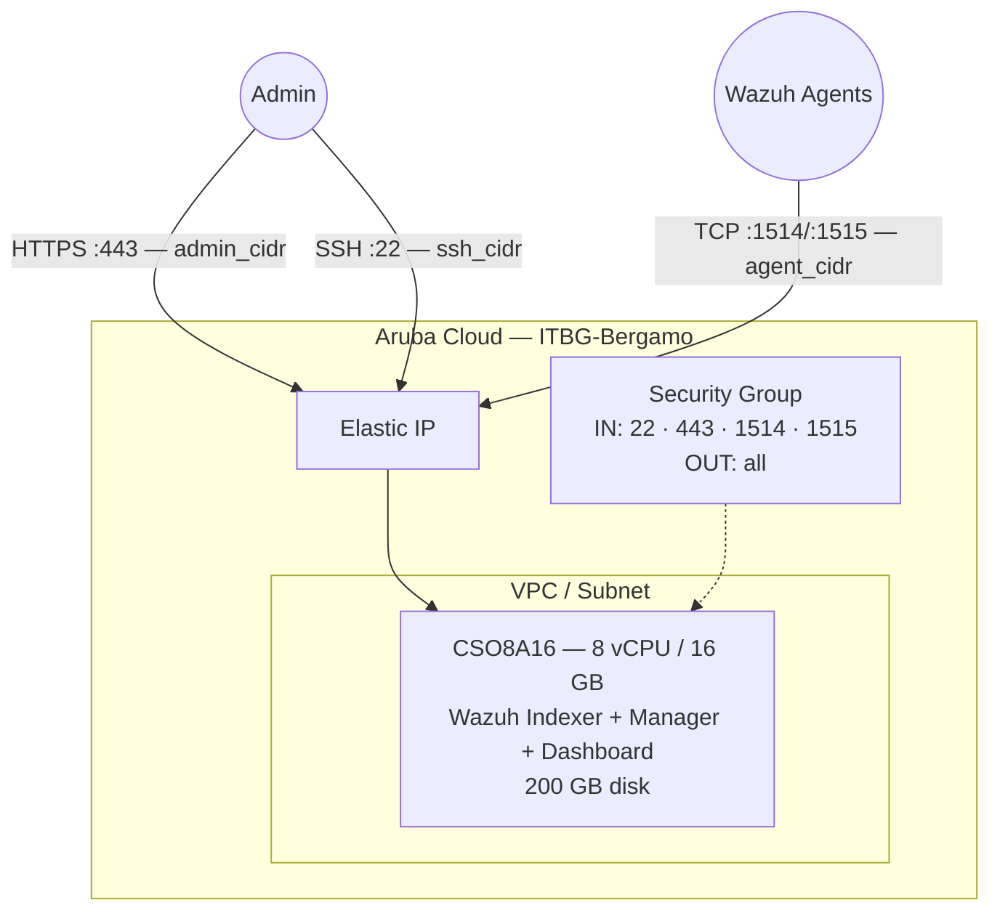

# Wazuh on Aruba Cloud

Deploy [Wazuh](https://wazuh.com) — an open-source SIEM, XDR, and CSPM platform — on Aruba Cloud using Terraform and cloud-init. This example provisions a **single-node all-in-one** deployment using the official Wazuh quick-install script.

> **Provider version:** arubacloud/arubacloud `~> 0.5` | **Terraform:** ≥ 1.9

---

## Introduction

Wazuh is a unified security platform that combines a SIEM (Security Information and Event Management) system, XDR (Extended Detection and Response), and CSPM (Cloud Security Posture Management) into a single solution. The all-in-one deployment bundles:

- **Wazuh Indexer** — OpenSearch-based log indexing and alerting engine
- **Wazuh Manager** — Agent management, rule correlation, and threat detection
- **Wazuh Dashboard** — Kibana-based web UI for alerts, compliance, and investigation

> **Resource requirements:** Wazuh is resource-intensive. The minimum for a usable all-in-one deployment is **8 vCPU / 16 GB RAM** and **200 GB disk**. Do not attempt to deploy on a smaller VM — the OpenSearch indexer will OOM and fail.

> **Bootstrap time:** The installer downloads and configures multiple components. Expect **20–30 minutes** before the dashboard is accessible.

---

## Architecture Overview



---

## Infrastructure Created

| Resource | Name pattern | Description |
|----------|-------------|-------------|
| `arubacloud_project` | `wazuh-prod` | Project container |
| `arubacloud_vpc` | `wazuh-prod-vpc` | Virtual Private Cloud |
| `arubacloud_subnet` | `wazuh-prod-subnet` | Basic subnet |
| `arubacloud_securitygroup` | `wazuh-prod-vm-sg` | Security group |
| `arubacloud_securityrule` | `wazuh-prod-vm-ssh` | SSH ingress |
| `arubacloud_securityrule` | `wazuh-prod-vm-dashboard` | HTTPS dashboard TCP 443 |
| `arubacloud_securityrule` | `wazuh-prod-vm-agent-events` | Agent events TCP 1514 |
| `arubacloud_securityrule` | `wazuh-prod-vm-agent-enroll` | Agent enrollment TCP 1515 |
| `arubacloud_elasticip` | `wazuh-prod-vm-eip` | VM public IP |
| `arubacloud_blockstorage` | `wazuh-prod-boot` | 200 GB boot disk (Performance) |
| `arubacloud_keypair` | `wazuh-prod-keypair` | SSH public key |
| `arubacloud_cloudserver` | `wazuh-prod-vm` | CloudServer VM |

---

## Estimated Monthly Cost

| Resource | Spec | Est. cost/mo |
|----------|------|-------------|
| CloudServer VM | CSO8A16 — 8 vCPU / 16 GB | ~€95 |
| Boot disk | 200 GB Performance | ~€30 |
| Elastic IP | — | ~€3 |
| **Total** | | **~€128/mo** |

---

## Requirements

- Terraform ≥ 1.9
- ArubaCloud Terraform Provider `~> 0.5`
- An ArubaCloud account with OAuth2 API credentials
- An SSH key pair

---

## Variables

### Required

| Variable | Description |
|----------|-------------|
| `arubacloud_client_id` | ArubaCloud OAuth2 client ID |
| `arubacloud_client_secret` | ArubaCloud OAuth2 client secret |
| `ssh_public_key` | SSH public key content |
| `admin_password` | Wazuh dashboard admin password (min 8 chars, must include upper, lower, digit, special) |

### Optional

| Variable | Default | Description |
|----------|---------|-------------|
| `app_name` | `"wazuh"` | Short name used in all resource names |
| `environment` | `"prod"` | Environment label |
| `location` | `"ITBG-Bergamo"` | ArubaCloud region |
| `zone` | `"ITBG-1"` | Availability zone |
| `billing_period` | `"Hour"` | `"Hour"` or `"Month"` |
| `vm_flavor` | `"CSO8A16"` | CloudServer flavor (8 vCPU / 16 GB minimum) |
| `vm_image` | `"LU22-001"` | Boot disk image (Ubuntu 22.04 LTS) |
| `vm_disk_size_gb` | `200` | Boot disk size in GB (min 50 GB) |
| `ssh_cidr` | `"0.0.0.0/0"` | CIDR for SSH — restrict in production |
| `admin_cidr` | `"0.0.0.0/0"` | CIDR for HTTPS dashboard — **always restrict** |
| `agent_cidr` | `"0.0.0.0/0"` | CIDR for agent ports 1514/1515 |

---

## Outputs

| Output | Description |
|--------|-------------|
| `dashboard_url` | Wazuh dashboard HTTPS URL |
| `vm_public_ip` | Public IP address of the VM |
| `ssh_command` | SSH command to connect to the VM |
| `agent_manager_ip` | Manager IP to configure in agent `ossec.conf` |

---

## Deployment Instructions

### 1. Clone and navigate

```bash
git clone https://github.com/arubacloud/terraform-arubacloud-examples.git
cd terraform-arubacloud-examples/wazuh
```

### 2. Configure variables

```bash
cp terraform.tfvars.example terraform.tfvars
```

Set credentials, a strong admin password, and restrict CIDRs:

```hcl
admin_password = "Ch@ngeMe2024!"
admin_cidr     = "203.0.113.42/32"
agent_cidr     = "10.0.0.0/8"
ssh_cidr       = "203.0.113.42/32"
```

### 3. Deploy

```bash
terraform init
terraform plan
terraform apply
```

> Terraform `apply` completes in ~2 minutes (VM provisioned). The Wazuh bootstrap continues in the background for **20–30 minutes**. Monitor progress:
>
> ```bash
> ssh ubuntu@$(terraform output -raw vm_public_ip)
> sudo tail -f /var/log/wazuh-install.log
> ```

### 4. Access the dashboard

```bash
terraform output dashboard_url
```

Log in with `admin` / `admin_password`. Accept the self-signed certificate warning (or install a trusted certificate later).

### 5. Install agents on monitored hosts

On each host you want to monitor:

```bash
curl -s https://packages.wazuh.com/key/GPG-KEY-WAZUH | apt-key add -
echo "deb https://packages.wazuh.com/4.x/apt/ stable main" \
  | tee /etc/apt/sources.list.d/wazuh.list
apt-get update && apt-get install -y wazuh-agent

# Configure the manager address
WAZUH_MANAGER="$(terraform output -raw agent_manager_ip)" \
  systemctl start wazuh-agent
systemctl enable wazuh-agent
```

---

## Security Recommendations

1. **Always restrict `admin_cidr`** to your management IP. The Wazuh dashboard contains full security event data for your infrastructure.

2. **Restrict `agent_cidr`** to the CIDR of your monitored infrastructure, not `0.0.0.0/0`. This prevents arbitrary agents from enrolling.

3. **Replace the self-signed certificate.** The quick-install generates a self-signed cert. For production, use a proper certificate — either via Let's Encrypt (requires a domain) or your own CA.

---

## Troubleshooting

### Dashboard not loading after 30 minutes

```bash
ssh ubuntu@$(terraform output -raw vm_public_ip)
sudo tail -50 /var/log/wazuh-install.log
sudo systemctl status wazuh-indexer wazuh-manager wazuh-dashboard
```

The most common cause is insufficient RAM — verify the VM has at least 16 GB and that OpenSearch is not OOM-killed:

```bash
sudo journalctl -u wazuh-indexer -n 50
dmesg | grep -i "killed process"
```

### Login fails after deploy

The password change may have failed. Check the log:

```bash
sudo cat /var/log/wazuh-password-change.log
```

If needed, SSH into the VM and re-run the password tool manually:

```bash
sudo bash /root/wazuh-install-files/wazuh-passwords-tool.sh \
  -u admin -p "YourNewPassword" -A
sudo systemctl restart wazuh-indexer wazuh-manager wazuh-dashboard
```

---

## References

- [Wazuh Documentation](https://documentation.wazuh.com)
- [Wazuh Quick-Start Guide](https://documentation.wazuh.com/current/quickstart.html)
- [Wazuh Agent Installation](https://documentation.wazuh.com/current/installation-guide/wazuh-agent/index.html)
- [ArubaCloud Terraform Provider](https://registry.terraform.io/providers/arubacloud/arubacloud/latest/docs)
