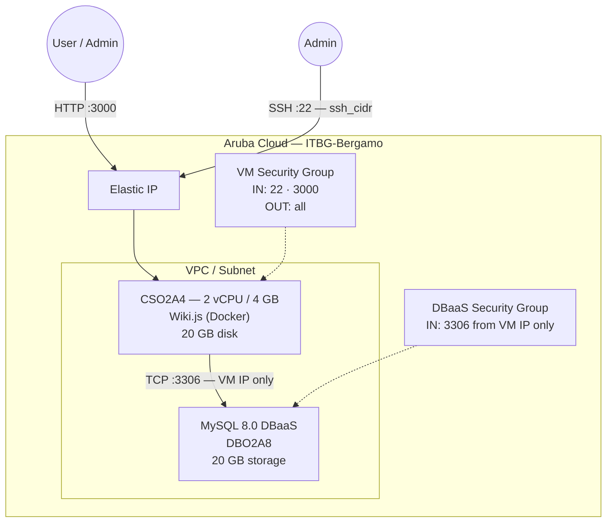

# Wiki.js on Aruba Cloud

Deploy [Wiki.js](https://js.wiki/) — a modern, open-source wiki platform with Markdown support, full-text search, and pluggable authentication — on Aruba Cloud using Terraform and cloud-init. Uses Managed MySQL 8.0 as the database backend.

> **Provider version:** arubacloud/arubacloud `~> 0.5` | **Terraform:** ≥ 1.9

---

## Introduction

Wiki.js is a lightweight, Node.js-based wiki that runs entirely in Docker. This example deploys:

- **Wiki.js** via the official Docker image on a CSO2A4 VM
- **Managed MySQL 8.0** (Aruba Cloud DBaaS) for reliable, managed storage
- Web UI on port **3000**
- Setup wizard on first access to create the admin account

---

## Architecture Overview



---

## Infrastructure Created

| Resource | Name pattern | Description |
|----------|-------------|-------------|
| `arubacloud_project` | `wikijs-prod` | Project container |
| `arubacloud_vpc` | `wikijs-prod-vpc` | Virtual Private Cloud |
| `arubacloud_subnet` | `wikijs-prod-subnet` | Basic subnet |
| `arubacloud_securitygroup` | `wikijs-prod-vm-sg` | VM security group |
| `arubacloud_securitygroup` | `wikijs-prod-dbaas-sg` | DBaaS security group |
| `arubacloud_securityrule` | `wikijs-prod-vm-ssh` | SSH ingress (22) |
| `arubacloud_securityrule` | `wikijs-prod-vm-http` | Wiki.js ingress (3000) |
| `arubacloud_securityrule` | `wikijs-prod-db-mysql` | MySQL ingress (3306, VM IP only) |
| `arubacloud_elasticip` | `wikijs-prod-vm-eip` | VM public IP |
| `arubacloud_elasticip` | `wikijs-prod-dbaas-eip` | DBaaS public IP |
| `arubacloud_dbaas` | `wikijs-prod-dbaas` | MySQL 8.0 managed instance |
| `arubacloud_database` | `wikijs` | Database schema |
| `arubacloud_dbaasuser` | `wikijs` | Database user |
| `arubacloud_databasegrant` | — | Full grant on wikijs database |
| `arubacloud_blockstorage` | `wikijs-prod-boot` | 20 GB boot disk (Performance) |
| `arubacloud_keypair` | `wikijs-prod-keypair` | SSH public key |
| `arubacloud_cloudserver` | `wikijs-prod-vm` | CloudServer VM |

---

## Estimated Monthly Cost

| Resource | Spec | Est. cost/mo |
|----------|------|-------------|
| CloudServer VM | CSO2A4 — 2 vCPU / 4 GB | ~€20 |
| Boot disk | 20 GB Performance | ~€3 |
| Elastic IP (VM) | — | ~€3 |
| MySQL DBaaS | DBO2A8 · 20 GB | ~€30 |
| Elastic IP (DBaaS) | — | ~€3 |
| **Total** | | **~€59/mo** |

---

## Requirements

- Terraform ≥ 1.9
- ArubaCloud Terraform Provider `~> 0.5`
- An ArubaCloud account with OAuth2 API credentials
- An SSH key pair

---

## Variables

### Required

| Variable | Description |
|----------|-------------|
| `arubacloud_client_id` | ArubaCloud OAuth2 client ID |
| `arubacloud_client_secret` | ArubaCloud OAuth2 client secret |
| `ssh_public_key` | SSH public key content |
| `db_password` | MySQL password (min 16 chars, no newlines) |

### Optional

| Variable | Default | Description |
|----------|---------|-------------|
| `app_name` | `"wikijs"` | Short name used in resource names |
| `environment` | `"prod"` | Environment label |
| `location` | `"ITBG-Bergamo"` | ArubaCloud region |
| `zone` | `"ITBG-1"` | Availability zone |
| `billing_period` | `"Hour"` | `"Hour"` or `"Month"` |
| `vm_flavor` | `"CSO2A4"` | CloudServer flavor |
| `vm_disk_size_gb` | `20` | Boot disk size in GB |
| `ssh_cidr` | `"0.0.0.0/0"` | CIDR for SSH access |
| `dbaas_flavor` | `"DBO2A8"` | Managed MySQL flavor |
| `db_storage_gb` | `20` | DBaaS initial storage in GB |
| `wikijs_version` | `"2"` | Wiki.js Docker image tag |

---

## Outputs

| Output | Description |
|--------|-------------|
| `wikijs_url` | Wiki.js web UI URL |
| `vm_public_ip` | Public IP of the VM |
| `ssh_command` | SSH command to connect |
| `db_host` | DBaaS public IP address |

---

## Deployment Instructions

### 1. Clone and navigate

```bash
git clone https://github.com/arubacloud/terraform-arubacloud-examples.git
cd terraform-arubacloud-examples/wikijs
```

### 2. Configure variables

```bash
cp terraform.tfvars.example terraform.tfvars
```

### 3. Deploy

```bash
terraform init
terraform plan
terraform apply
```

Bootstrap takes approximately **2–3 minutes**.

### 4. Initial setup

Navigate to `http://<vm_public_ip>:3000` and complete the installation wizard to create the admin account and configure the site.

---

## References

- [Wiki.js Documentation](https://docs.requarks.io/)
- [Wiki.js Docker Hub](https://hub.docker.com/r/requarks/wiki)
- [ArubaCloud Terraform Provider](https://registry.terraform.io/providers/arubacloud/arubacloud/latest/docs)
