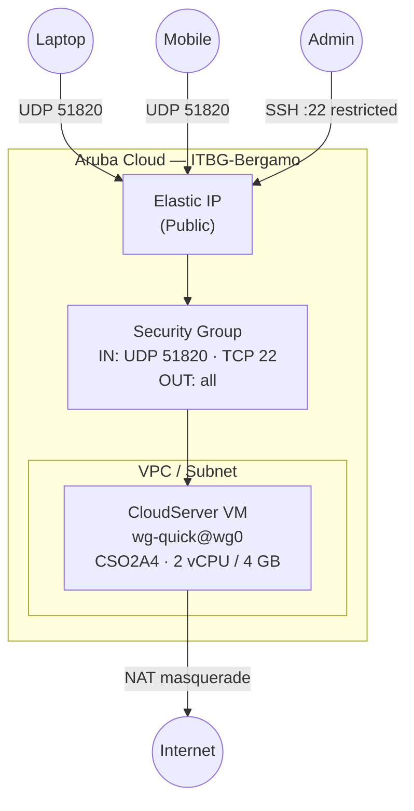

# WireGuard VPN on Aruba Cloud

Deploy a production-ready [WireGuard](https://www.wireguard.com/) VPN server on Aruba Cloud. All configuration is handled by cloud-init — no manual SSH required after deployment.

> **Provider version:** arubacloud/arubacloud `~> 0.5` | **Terraform:** ≥ 1.9

---

## Introduction

WireGuard is a modern, high-performance VPN protocol built into the Linux kernel. It is simpler, faster, and more secure than OpenVPN or IPsec. This example deploys a WireGuard server that your devices can connect to for encrypted internet access or private network tunneling.

Common use cases:

- Secure remote access to your Aruba Cloud VMs without exposing extra ports
- Route all device traffic through a trusted Aruba Cloud IP
- Split-tunnel access to private VPC resources

---

## Architecture Overview

A single CloudServer VM runs the `wg-quick@wg0` systemd service. The WireGuard server keys are generated on first boot by cloud-init. Clients connect over UDP 51820. SSH is restricted to your admin IP; no HTTP/HTTPS ports are opened.



---

## Infrastructure Created

| Resource | Name pattern | Description |
|----------|-------------|-------------|
| `arubacloud_project` | `wg-prod` | Project container |
| `arubacloud_vpc` | `wg-prod-vpc` | Virtual Private Cloud |
| `arubacloud_subnet` | `wg-prod-subnet` | Basic subnet |
| `arubacloud_securitygroup` | `wg-prod-vm-sg` | VM security group |
| `arubacloud_securityrule` | `wg-prod-vm-ssh` | SSH ingress (admin CIDR) |
| `arubacloud_securityrule` | `wg-prod-wg-udp` | WireGuard UDP ingress |
| `arubacloud_elasticip` | `wg-prod-vm-eip` | VM public IP |
| `arubacloud_blockstorage` | `wg-prod-boot` | 20 GB boot disk |
| `arubacloud_keypair` | `wg-prod-keypair` | SSH public key |
| `arubacloud_cloudserver` | `wg-prod-vm` | WireGuard VM |

---

## VM Sizing Recommendation

| Use case | vCPU | RAM | Disk | Flavor |
|----------|------|-----|------|--------|
| Personal VPN | 1–2 | 2–4 GB | 20 GB | `CSO2A4` *(default)* |
| Team VPN (10–50 users) | 2 | 4 GB | 20 GB | `CSO2A4` |
| High-throughput | 4 | 8 GB | 20 GB | `CSO4A8` |

WireGuard is extremely CPU-efficient — a `CSO2A4` VM comfortably handles 50+ concurrent clients.

---

## Estimated Monthly Cost

| Resource | Spec | Est. cost/mo |
|----------|------|-------------|
| CloudServer VM | CSO2A4 — 2 vCPU / 4 GB | ~€20 |
| Boot disk | 20 GB Performance | ~€3 |
| Elastic IP | — | ~€5 |
| **Total** | | **~€28/mo** |

---

## Requirements

- Terraform ≥ 1.9
- ArubaCloud Terraform Provider `~> 0.5`
- ArubaCloud account with OAuth2 credentials
- An SSH key pair

---

## Variables

### Required

| Variable | Description |
|----------|-------------|
| `arubacloud_client_id` | ArubaCloud OAuth2 client ID |
| `arubacloud_client_secret` | ArubaCloud OAuth2 client secret |
| `ssh_public_key` | SSH public key content |

### Optional

| Variable | Default | Description |
|----------|---------|-------------|
| `app_name` | `"wg"` | Short name for resource names |
| `environment` | `"prod"` | Environment label |
| `location` | `"ITBG-Bergamo"` | ArubaCloud region |
| `zone` | `"ITBG-1"` | Availability zone |
| `vm_flavor` | `"CSO2A4"` | CloudServer flavor |
| `vm_disk_size_gb` | `20` | Boot disk size in GB |
| `ssh_cidr` | `"0.0.0.0/0"` | CIDR for SSH — **restrict to your IP** |
| `vpn_port` | `51820` | WireGuard UDP port |
| `vpn_server_address` | `"10.8.0.1/24"` | Server VPN interface address |
| `dns_servers` | `["1.1.1.1","1.0.0.1"]` | DNS pushed to clients |
| `billing_period` | `"Hour"` | `"Hour"` or `"Month"` |

---

## Deployment Instructions

### 1. Clone and navigate

```bash
git clone https://github.com/arubacloud/terraform-arubacloud-examples.git
cd terraform-arubacloud-examples/wireguard
```

### 2. Configure variables

```bash
cp terraform.tfvars.example terraform.tfvars
# Edit terraform.tfvars
```

### 3. Deploy

```bash
terraform init
terraform plan
terraform apply
```

### 4. Retrieve the server public key

After deployment, get the server public key (needed to configure clients):

```bash
terraform output -raw get_server_pubkey_command | bash
# Example output: 8Zn3...abc=
```

### 5. Configure your client

Generate a client key pair on your device:

```bash
wg genkey | tee client.key | wg pubkey > client.pub
```

Get the client config template from Terraform:

```bash
terraform output client_config_template
```

Replace `<CLIENT_PRIVATE_KEY>` with the content of `client.key` and `<SERVER_PUBKEY>` with the server public key.

### 6. Add a peer to the server

SSH into the server and add your client's public key:

```bash
ssh ubuntu@$(terraform output -raw server_public_ip)
sudo wg set wg0 peer <CLIENT_PUBKEY> allowed-ips 10.8.0.2/32
sudo wg-quick save wg0
```

---

## Destroy Instructions

```bash
terraform destroy
```

---

## Security Recommendations

1. **Restrict SSH to your IP.** Set `ssh_cidr = "your.ip/32"`. The WireGuard UDP port should be open to all (clients connect from variable IPs).
2. **Rotate server keys if compromised.** SSH in, run `wg genkey | tee /etc/wireguard/server.key | wg pubkey > /etc/wireguard/server.pub`, then restart the service. All clients will need to update their peer `PublicKey`.
3. **Use different VPN addresses per client.** Assign unique IPs (`10.8.0.2/32`, `10.8.0.3/32`, ...) so you can revoke individual clients by removing their peer entry.
4. **Keep the kernel updated.** WireGuard is a kernel module — `apt-get upgrade` keeps it current.

---

## Upgrade Considerations

WireGuard itself is part of the Linux kernel — no binary upgrades are needed. To upgrade the OS:

```bash
ssh ubuntu@$(terraform output -raw server_public_ip)
sudo apt-get update && sudo apt-get upgrade -y
sudo reboot  # reconnect after ~30 seconds
```

---

## Screenshots

> **Screenshot placeholder.** Add a screenshot of `sudo wg show` output confirming active peers.

---

## Troubleshooting

### Cannot connect from client

1. Check firewall: `sudo wg show` — if there are no peers, you forgot to add the peer with `wg set wg0 peer ...`.
2. Check the UDP port is open: from another machine, `nc -u <SERVER_IP> 51820`.
3. Check IP forwarding: `cat /proc/sys/net/ipv4/ip_forward` should return `1`.
4. Check the service is running: `sudo systemctl status wg-quick@wg0`.

### Keys were not generated (cloud-init failed)

```bash
ssh ubuntu@<SERVER_IP>
sudo tail -100 /var/log/cloud-init-output.log
```

If `/etc/wireguard/server.key` is missing, re-run the setup manually:

```bash
sudo wg genkey | sudo tee /etc/wireguard/server.key | sudo wg pubkey | sudo tee /etc/wireguard/server.pub
sudo chmod 600 /etc/wireguard/server.key
sudo systemctl restart wg-quick@wg0
```

---

## References

- [WireGuard Quick Start](https://www.wireguard.com/quickstart/)
- [WireGuard Man Page](https://man7.org/linux/man-pages/man8/wg.8.html)
- [ArubaCloud Terraform Provider](https://registry.terraform.io/providers/arubacloud/arubacloud/latest/docs)
